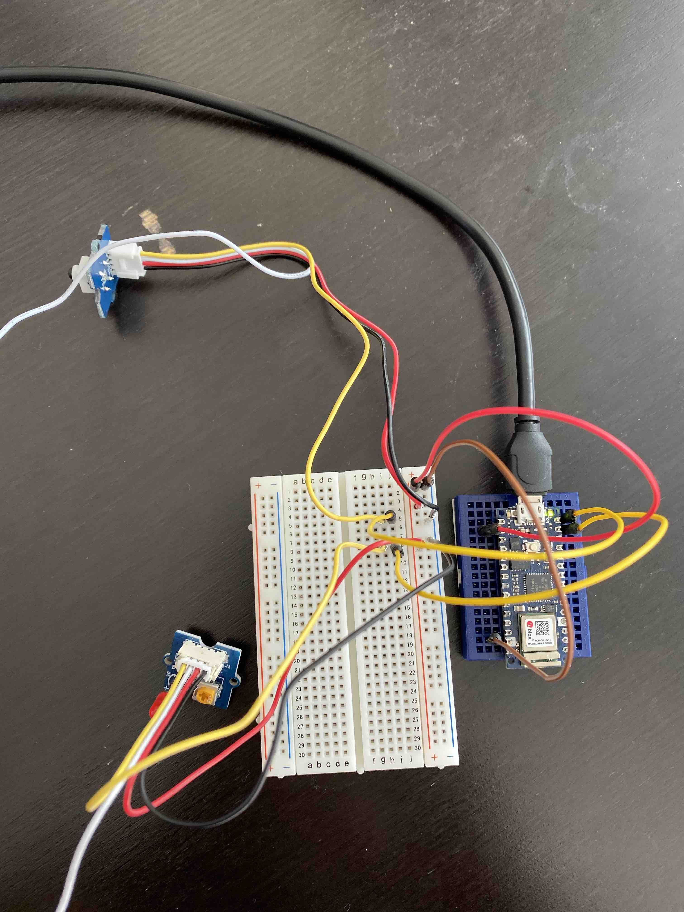
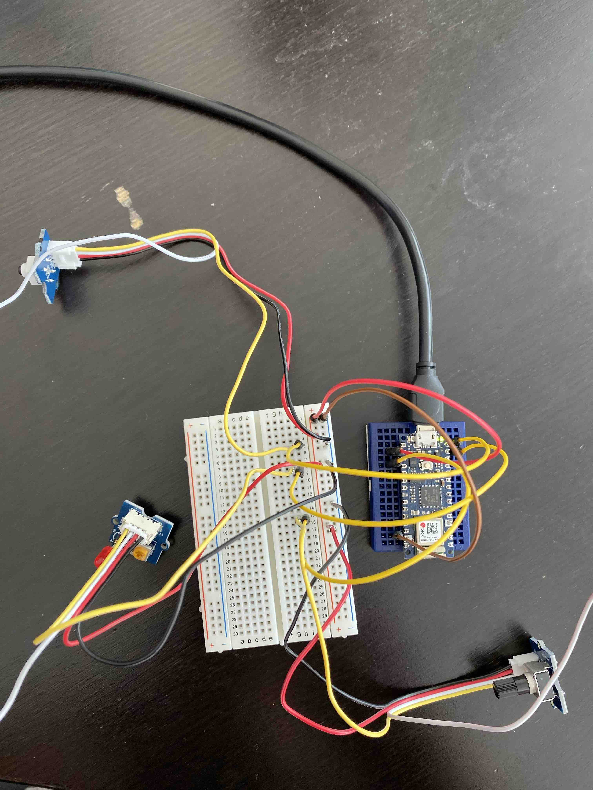
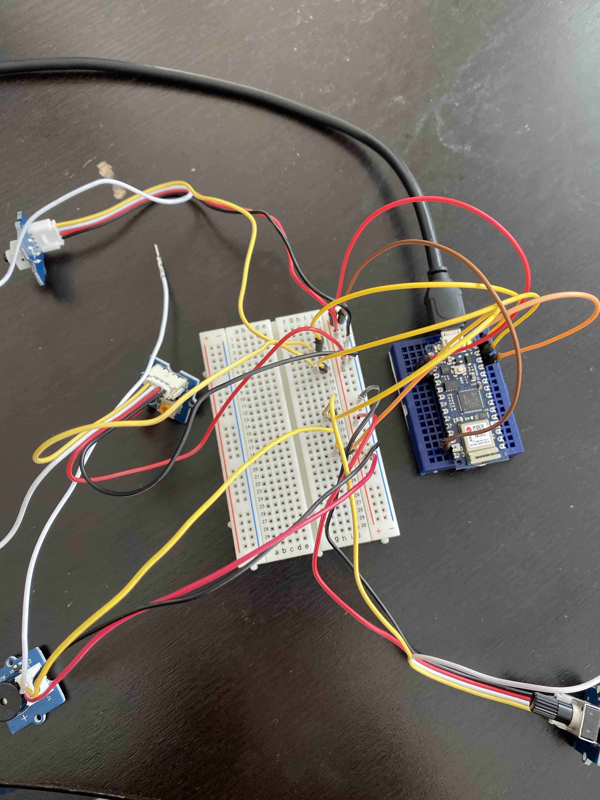

# tinygo-lessons
Using TinyGo to program the Arduino Nano 33 IoT, demonstrating hardware
control and internet connectivity.

## Setup

### Go
TinyGo uses Go to build. And Go's a great thing to have around anyway.
#### Linux
```
sudo apt update
sudo apt-get install golang-1.13-go
```

#### macOS
```
brew update
brew install go
```
#### Windows
Install from MSI or source https://golang.org/dl/

### TinyGo
Use the links below to understand how to get TinyGo and the AVR microcontroller 
dependencies installed on your system.

#### Linux
https://tinygo.org/getting-started/linux/

#### macOS
```
brew tap tinygo-org/tools
brew install tinygo

brew tap osx-cross/avr
brew install avr-gcc avrdude
```

#### Windows (Experimental)
https://tinygo.org/getting-started/windows/

### TinyGo Drivers
```
go get -u tinygo.org/x/drivers
go get -u github.com/eclipse/paho.mqtt.golang
```

### bossac CLI tool
#### Linux
```
sudo apt install \
  libwxgtk3.0-dev
  libreadline-dev
git clone https://github.com/shumatech/BOSSA.git
cd BOSSA
make
```

### macOS or Windows
[Download the installer](https://github.com/shumatech/BOSSA/releases/download/1.9.1/bossa-1.9.1.dmg)


## Lesson Structure


### IMPORTANT! macOS-specific required steps (Linux users can ignore)
The Linux and macOS device subsystems have subtle differences. **In order to talk to the Arduino board on a Mac**, you need to discover how macOS
system has named it. Plug it in and follow these commands:

```
ls /dev | grep usb
```

Should produce entries like (you may have different numbers after
`usbmodem`):

```
/dev/cu.usbmodem141201
/dev/tty.usbmodem141201
```

The entry with `tty` is going into an environment variable. We'll use this below in the macOS version of the steps.
Make sure that you use a full path. It will look something like the above. Then export it into your shell:

```sh
export NANO33_DEV_PATH=/dev/tty.YOUR_USBMODEM_ID
```

#### lesson0
"hello, world!" - blinking the onboard LED on an interval

* Flashing basics
* Using the machine abstraction

**Running it - Linux**
```tinygo flash -target arduino-nano33 ./lesson0/main.go```

**Running it - macOS**
```tinygo flash -target arduino-nano33 -port=$NANO33_DEV_PATH ./lesson0/main.go```

---

#### lesson1
Goroutines and UART print
* goroutines let you do more than one thing at once
* TinyGo uses UART for built-in debugging b/c of its ubquity
* `screen` to connect to serial interface

**Running it - Linux**
```tinygo flash -target arduino-nano33 ./lesson1/main.go```

**Running it - macOS**
```tinygo flash -target arduino-nano33 -port=$NANO33_DEV_PATH ./lesson1/main.go```

**Screen command to read println statements**
```screen $NANO33_DEV_PATH 9600```

---

#### lesson2
Connecting an external LED to a pin
* Breadboards and their rails
* Using jumper wires and pins
* Blinking the LED with a button



**Steps:**

* Run a red jumper wire from the 3.3v power pin on the board to the **+**  rail on the breadboard.
* Run a black jumper wire from the GND pin on the board to the **-** rail on the breadboard.
* NOTE: you only need to do the above once to power the entire breadboard.
* Plug the LED bulb (gently!) into the socket. If it doesn't light up in later steps, pull it out and turn it around.
* Plug a jumper wire into pin D11 on the board and run it to a rail in the middle of the breadboard (5 is a good one to start)
* Plug your LED component's red and black lines into power and ground slots on the breadboard.
* Plug your LED's **yellow** wire in-line with the jumper you ran to D11
* Replicate the above with the button component, adding power and ground and then running your control jumper to D12 on the 10 line of the breadboard and plugging your yellow wire in-line.
* Flash the board and use the button to control the LED


**Running it - Linux**
```tinygo flash -target arduino-nano33 ./lesson2/main.go```

**Running it - macOS**
```tinygo flash -target arduino-nano33 -port=$NANO33_DEV_PATH ./lesson2/main.go```

---

#### lesson3
Analog rotation sensor to control an LED, understanding PWM and ADC
* Use rotation sensor as a dimmer switch
* Send rotation info to UART for debugging




**Steps**

* Run a jumper wire from pin A0 on the board to row 15 on your breadboard and then wire up your rotary sensor 
* Flash the board and then use the rotary sensor to brighten/dim the LED
* Connect to the UART interface with `screen $NANO33_DEV_PATH 9600` and watch the values change as you rotate the sensor

**Running it - Linux**
```tinygo flash -target arduino-nano33 ./lesson3/main.go```

**Running it - macOS**
```tinygo flash -target arduino-nano33 -port=$NANO33_DEV_PATH ./lesson3/main.go```

---

#### lesson4
Buzzer to create rotation threshold
* Transforming analog values
* Understanding ADC range



**Steps**

* Run a jumper wire from pin D11 on the board to row 20 on your breadboard and then wire up your buzzer
* Flash the board. When you turn the rotary sensor enough, the buzzer will sound. If the buzzer is sounding when your board is flashed, turn the rotary sensor until it stops making noise.


**Running it - Linux**
```tinygo flash -target arduino-nano33 ./lesson4/main.go```

**Running it - macOS**
```tinygo flash -target arduino-nano33 -port=$NANO33_DEV_PATH ./lesson4/main.go```

---

#### lesson5
Sending data to an MQTT broker
* Connect to wifi
* Send MQTT message when pressing a button

** Steps **
* Open `lesson6/main.go` in an editor and change all instances of the string "unit1" to your first name. Save the file.
* Flash the board, wait a couple seconds, and then connect to the UART interface: (`screen $NANO33_DEV_PATH 9600`). You should see the device get provisioned with an IP and also see the gateway address and netmask.
* Press the button to send an MQTT message to the broker on the local network.


**Running it - Linux**
```tinygo flash -target arduino-nano33 ./lesson5/main.go```

**Running it - macOS**
```tinygo flash -target arduino-nano33 -port=$NANO33_DEV_PATH ./lesson5/main.go```


## Auxiliary

### Docker-based MQTT Server
`docker run -it -p 1883:1883 -p 9001:9001 eclipse-mosquitto`


## Links

* [UART](https://en.wikipedia.org/wiki/Universal_asynchronous_receiver-transmitter)
* [screen](https://www.gnu.org/software/screen/)


## Bill of Materials

* Arduino Nano33 IoT with headers
* Tiny breadboard 
* Small breadboard
* Jumpwires
* Seeed Studios Grove LED (modified with male terminators for breadboard)
* Seeed Studios Grove button (modified with male terminators for breadboard)
* Seeed Studios Grove buzzer (modified with male terminators for breadboard)
* Seeed Studios Grove rotation sensor (modified with male terminators for breadboard)


## Credits
Thanks to TinyGo creator Ayke van Laethem (@aykevl) and Ron Evans (@deadprogram) of the [HybridGroup](https://hybridgroup.com) for their work on TinyGo, related [workshop content](https://github.com/hybridgroup/hacklab-2019), and valuable input into these lessons.


